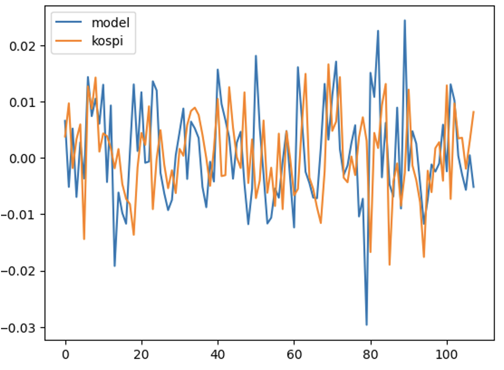

#  강화학습을 이용한 포트폴리오 투자 프로세스 최적화에 대한 연구(2023/10 Done)
---

## 목차 (Table of Contents)

1. [프로젝트 소개 (Introduction)](#프로젝트-소개-introduction)  
2. [분석 핵심 (Point)](#프로젝트-핵심-Point)  
3. [프로젝트 구조 (Project-Structure)](#프로젝트-구조-project-structure)  


---
## 프로젝트 소개 (Introduction)

---

## 프로젝트 핵심 (Point)

- **목적**: 포트폴리오 투자에 있어 2가지 스텝이 존재한다. 투자 유니버스를 설정하는 문제와 설정한 유니버를 얼만큼 투자(할당)할 것인지에 대한 문제이다. 
- **기존 방법론에 대한 한계점**:
  - 유니버스 설정과 할당문제을 동시에 고려하지 않았다.
    
- **가설**:
  - 강화학습을 활용해 유니버스 설정과 할당문제를 동시에 해결할 수 있을 것이다.
     

- **검정 방법**
  - 각 시점의 포트폴리오의 수익률을 밴치마크와 비교해본더.  


## 프로젝트 구조 (Project structure)




## 의사결정 코드 (Pseudo Code)

아래는 RL1, RL2 두 가지 모델을 활용하여 투자 의사결정을 진행하는 과정을 단순화한 **의사코드**입니다.


```plaintext

RL1
한 마르코프 과정 ( 
For episode = 1,E do
 For all model1 rebalancing time t = 1,T do
Step: Input data가 model1에 들어가 팩터 가중치 출력: 
해당 출력값을 통해 20개의 종목을 선정
25개의 종목을 통해 RL2 모델을 학습
RL2모델의 전체 에피소드의 평균 점수: 
54일 이후 데이터로 model1 학습진행: 

RL1 모델 파라미터 업데이트

RL2 
For episode = 1,E do
 For all model2 rebalancing time t = 1,T do
RL1에서 받은 각 종목의 가중치 출력:  
  포트폴리오의 가중치로 weighted return계산:  
  하루 이후 데이터를 가지고 model2 진행:  


